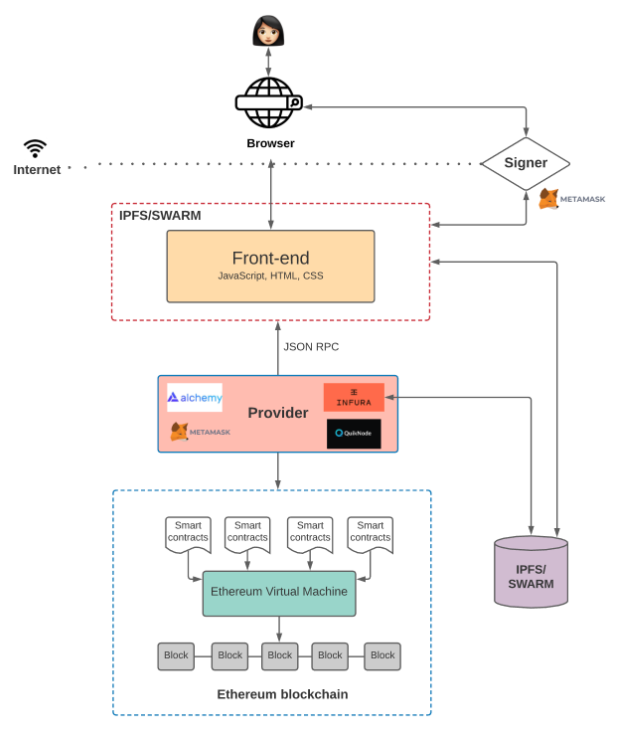

# ethereum 以太坊

[以太坊区块链文档](https://ethereum.org/zh/developers/docs/intro-to-ethereum)

以太坊 (Ethereum) 是一个开源、去中心化，支持智能合约的区块链网络。以太坊最初采用工作量证明 (PoW) 的共识机制，2022 年 9 月 15 日于区块高度 15537394 切换为权益证明机制 (PoS)。
ETH 是以太坊网络的原生代币，是用户在以太坊网络交互的必需品，亦可以质押 ETH 成为验证者并通过验证区块等行为来维护网络安全。

去中心化应用 https://ethereum.org/zh/developers/docs/dapps

创建以太坊应用程序 - 使用一个命令创建以太坊驱动的应用程序。

https://github.com/WalletConnect/create-eth-app ， 创建一个以太坊app 

yarn create eth-app my-eth-app

warning "workspace-aggregator-41067c30-e552-418b-9ad5-1e910df7e551 > @my-app/react-app > react-scripts > eslint-config-react-app > @typescript-eslint/eslint-plugin > tsutils@3.21.0" has unmet peer dependency "typescript@>=2.8.0 || >= 3.2.0-dev || >= 3.3.0-dev || >= 3.4.0-dev || >= 3.5.0-dev || >= 3.6.0-dev || >= 3.6.0-beta || >= 3.7.0-dev || >= 3.7.0-beta".
[4/4] Building fresh packages...
success Saved lockfile.
Done in 143.13s.

Success! Created my-eth-app at /home/margin/my-eth-app
Inside that directory, you can run several commands:

  yarn react-app:start
    Starts the development server.

  yarn react-app:build
    Builds the app for production.

  yarn subgraph:codegen
    Generates AssemblyScript types for smart contract ABIs and the subgraph schema.

  yarn subgraph:deploy
    Deploys the subgraph to the official Graph Node.

We suggest that you begin by typing:

  cd my-eth-app
  yarn react-app:start

Done in 169.06s.

## web3 

Web2 指的是如今我们众所周知的互联网版本。 互联网由互联公司掌控，它们通过提供服务来换取个人数据。 就以太坊而言，Web3 指的是在区块链上运行的去中心化应用程序。 
任何用户都可以参与这些应用程序，而无需出卖个人数据。

 
[web3 应用程序架构](https://www.preethikasireddy.com/post/the-architecture-of-a-web-3-0-application)

